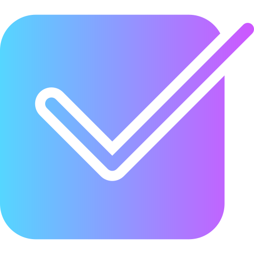
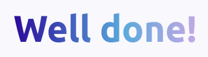
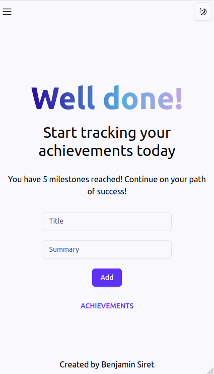

<div align="center">
  
  <br/>
  
</div>


## About the project
Well Done helps you keep track of all your accomplishments, from the smallest to the biggest victory.<br/>
I created this app to practice, improve my skills, and also because I wanted a way to keep track of my achievements. I tend to overlook how far I've come, and this app helps me to recognize and celebrate my successes.


<div align="center">
  
</div>

## Built with


## Setup
To run this project, clone the repo, and install it locally using npm:

```
npm install
```

Run the local server

```
npm run dev
```
